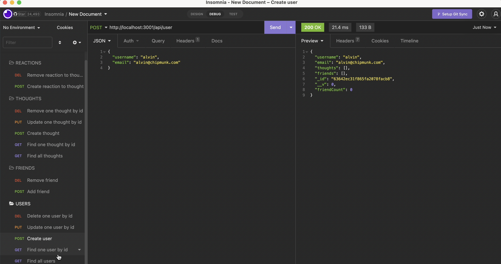

# Webfeather

  ###  

  ## Table of Contents
  - [Description](#description)
  - [Installation](#installation)
  - [Usage](#usage)
  - [Contributing](#contributing)
  - [Tests](#tests)
  - [Questions](#questions)
  - [License](#license)

  ## Description 
  Webfeather is a social networking API that uses the npm package Mongoose in connection with MongoDB, a non-relational database.  The intended purpose of this application is to manage data belonging to users including but not limited to their friends, thoughts, and reactions. <a href="https://drive.google.com/file/d/1tplmQPiOuV2IhmjKM3bislfSpC2_3l5T/view?usp=sharing">Walkthrough Video Link</a> 
  N.B.: Application in-progress
  
  ## Installation 
   1. MongoDB 6.0 (Please refer to https://www.mongodb.com/docs/manual/installation/ for instructions.) 2. Node.js (npm init) 3. npm i express@4.18.2 4. npm i mongoose@6.7.0 5. npm install --save-dev nodemon@2.0.20
  
  ## Usage
  npm start

  ## Contributing 
  Developers who have ideas for improvement may fork this project and submit pull requests for review.

  ## Tests
  Recommended: Use Insomnia to test API routes

  ## Questions 
  Please feel free to reach out via either of the links below if you have additional questions about this application. 
  GitHub: <a href="https://github.com/raposamillar/">raposamillar</a> 
  Email: lisa.raposamillar@gmail.com

  ## License
  ### This applicaton is covered under the [MIT](https://choosealicense.com/licenses/mit/) license.

  